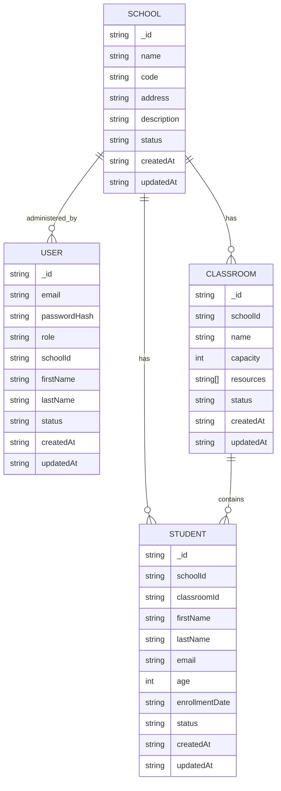

# School Management System API (Axion Template)

This project implements the backend technical challenge requirements using the existing Axion architecture pattern.

## Challenge Coverage

- RESTful API implemented with JavaScript/Node.js.
- Role-based access control (RBAC) implemented with a DB-backed role-permission policy manager.
- Redis data persistence implemented.
- Existing template architecture preserved (`ManagersLoader`, middleware stack, dynamic API handler).
- Core entities implemented:
  - Schools
  - Classrooms
  - Students
- JWT authentication and authorization middleware implemented.
- Input validation and standardized error handling implemented.
- Rate limiting middleware implemented.
- REST-style endpoint aliases added on top of the template dynamic routing.
- API documentation, schema design, test cases, and deployment instructions included.

## Architecture

### Request Flow

1. Request enters `UserServer` (`/api/v1/...` REST aliases or `/api/:moduleName/:fnName`).
2. `ApiHandler` resolves module + exposed method.
3. `VirtualStack` executes middleware pipeline (`__device`, `__rateLimit`, plus method-specific middleware like `__auth`).
4. Target manager method executes.
5. `ResponseDispatcher` normalizes HTTP response format.

### Main Managers

- `auth`: authentication + RBAC helpers + admin user management.
- `password`: reusable password hashing/verification abstraction (bcrypt).
- `schools`: school CRUD.
- `classrooms`: classroom CRUD and school association.
- `students`: enrollment, CRUD, transfer.
- `dataStore`: Redis abstraction (document + index operations).
- `token`: JWT token generation/verification.
- `authorization`: role-permission policy loaded from Redis + school scoping rules.

## Data Schema Design

Data is persisted in Redis JSON documents + index sets.



Additional authorization persistence:

- `role_permissions:<role>` docs in `role_permissions` collection
- policy version key: `sms:meta:authorization:policyVersion`

## Roles and Authorization

Authorization uses explicit roles + permissions, persisted in Redis:

- resources:
  - `school`
  - `classroom`
  - `student`
  - `user`
- actions:
  - `read`
  - `create`
  - `config`

Role-to-permission mapping:

- `superadmin`: full permissions and global scope.
- `school_admin`: scoped permissions to assigned `schoolId`.

Scope behavior:

- `superadmin` can access all schools/resources.
- `school_admin` can only access resources under `actor.schoolId`.
- School CRUD operations are restricted to `superadmin` only.
- Role-permission mappings are seeded on startup and read from `role_permissions` docs.
- Policy updates bump a policy version key and publish a Cortex event so in-process caches can invalidate.

## Setup

### Prerequisites

- Node.js 18+
- Redis server running locally or reachable via `REDIS_URI`

### Install

```bash
npm install
```

### Configure env

```bash
cp .env.example .env
# then fill secrets
```

### Run

```bash
npm run dev
```

`npm run dev` uses `nodemon` for automatic restart on file changes.

Server default port: `5111`.

## Response Contract

All endpoints return this envelope:

```json
{
  "ok": true,
  "data": {},
  "errors": [],
  "message": ""
}
```

## Authentication Flow

1. Bootstrap first superadmin.
2. Login to obtain JWT access token.
3. Send token using either:
   - `Authorization: Bearer <token>`
   - `token: <token>` header

## API Endpoints

Template dynamic route format:

```text
/api/:moduleName/:fnName
```

Primary REST aliases:

```text
POST   /api/v1/auth/bootstrap-superadmin
POST   /api/v1/auth/login
GET    /api/v1/auth/me
GET    /api/v1/users
PATCH  /api/v1/users/:userId
DELETE /api/v1/users/:userId
POST   /api/v1/schools/:schoolId/admins

POST   /api/v1/schools
GET    /api/v1/schools
GET    /api/v1/schools/:schoolId
PATCH  /api/v1/schools/:schoolId
DELETE /api/v1/schools/:schoolId

POST   /api/v1/classrooms
GET    /api/v1/classrooms
GET    /api/v1/classrooms/:classroomId
PATCH  /api/v1/classrooms/:classroomId
DELETE /api/v1/classrooms/:classroomId

POST   /api/v1/students
GET    /api/v1/students
GET    /api/v1/students/:studentId
PATCH  /api/v1/students/:studentId
DELETE /api/v1/students/:studentId
POST   /api/v1/students/:studentId/transfer
```

### Auth (`moduleName=auth`)

- `POST /api/auth/v1_bootstrapSuperadmin`
  - body: `email`, `password`, `firstName`, `lastName`
- `POST /api/auth/v1_login`
  - body: `email`, `password`
- `GET /api/auth/v1_me`
  - auth required
- `POST /api/auth/v1_createSchoolAdmin`
  - auth required (superadmin)
  - body: `schoolId`, `email`, `password`, `firstName`, `lastName`
- `GET /api/auth/v1_listUsers`
  - auth required
- `PATCH /api/auth/v1_updateUser`
  - auth required (superadmin)
  - body: `userId`, optional `email`, optional `password`, optional `firstName`, optional `lastName`, optional `status`, optional `schoolId`
- `DELETE /api/auth/v1_deleteUser`
  - auth required (superadmin)
  - body: `userId`

### Schools (`moduleName=schools`)

- `POST /api/schools/v1_createSchool` (superadmin)
- `GET /api/schools/v1_getSchool?schoolId=<id>`
- `GET /api/schools/v1_listSchools`
- `PATCH /api/schools/v1_updateSchool`
  - body: `schoolId`, optional `name`, `address`, `description`, `status`
- `DELETE /api/schools/v1_deleteSchool`
  - body: `schoolId` (superadmin)

### Classrooms (`moduleName=classrooms`)

- `POST /api/classrooms/v1_createClassroom`
  - body: `schoolId` (optional for school_admin), `name`, `capacity`, `resources[]`
- `GET /api/classrooms/v1_getClassroom?classroomId=<id>`
- `GET /api/classrooms/v1_listClassrooms?schoolId=<id>`
- `PATCH /api/classrooms/v1_updateClassroom`
- `DELETE /api/classrooms/v1_deleteClassroom`

### Students (`moduleName=students`)

- `POST /api/students/v1_enrollStudent`
  - body: `schoolId` (optional for school_admin), `classroomId`, `firstName`, `lastName`, `email`, `age`
- `GET /api/students/v1_getStudent?studentId=<id>`
- `GET /api/students/v1_listStudents?schoolId=<id>`
- `PATCH /api/students/v1_updateStudent`
- `POST /api/students/v1_transferStudent`
  - body: `studentId`, optional `targetSchoolId`, optional `targetClassroomId`
- `DELETE /api/students/v1_deleteStudent`

## Request/Response Examples

Create school:

```http
POST /api/v1/schools
Authorization: Bearer <token>
Content-Type: application/json

{
  "name": "Lagos International School",
  "code": "LIS-001",
  "address": "12 Admiralty Way, Lagos",
  "description": "Main campus"
}
```

Example success response:

```json
{
  "ok": true,
  "data": {
    "school": {
      "_id": "abc123",
      "name": "Lagos International School"
    }
  },
  "errors": [],
  "message": ""
}
```

Example forbidden response:

```json
{
  "ok": false,
  "data": {},
  "errors": [],
  "message": "forbidden"
}
```

## Security Measures Implemented

- JWT authentication middleware (`__auth`).
- Authorization middleware (`__authorize`) for handler-level permission gating.
- Role-permission checks at manager/service layer with school scope enforcement.
- Password hashing with `bcrypt`.
- Input validation on all mutable endpoints.
- Rate limiting middleware (`__rateLimit`) per IP/module/function.
- Request body size limit (`1mb`).

## Error Handling

- `400`: validation/business logic errors.
- `401`: unauthorized.
- `403`: forbidden (RBAC scope violation).
- `404`: resource not found.
- `405`: method not allowed for target module/function.
- `409`: conflict (e.g., email already in use, duplicate school code).
- `429`: too many requests.

## Test Cases and Results

Automated unit tests are included for validation and authorization logic:

```bash
npm test
```

Current suite:

- validation helper checks (`email`, `password`, number range, array validation)
- permission/scope checks (`superadmin` vs `school_admin`)
- middleware and status-code mapping checks
- auth admin-user management checks (create/list/update/delete guardrails)
- latest local run: `37` passed, `0` failed

## Deployment Instructions

1. Provision Redis instance.
2. Set environment variables from `.env.example`.
3. Install and run:
   - `npm install`
   - `npm run start`
4. Expose service behind reverse proxy/load balancer (recommended).
5. Configure process manager (PM2/systemd/container orchestration) for production.

## Submission Checklist

- Public repository URL: `<add-your-repository-url>`
- Deployed application URL: `<add-your-deployed-url>`
- Additional notes/assumptions: `<add-notes>`

## Assumptions

- This implementation keeps Axion’s dynamic module/function routing pattern.
- Persistence uses Redis documents and sets (instead of MongoDB).
- `school_admin` is scoped to a single `schoolId`.
- Student email uniqueness is enforced per school.
