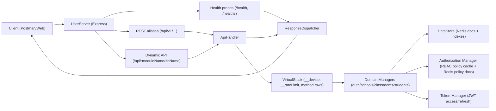

# Axion School Management System API

This repository implements the backend technical challenge on top of the Axion manager/middleware architecture, with full REST aliases, RBAC, Redis persistence, security hardening, Node 22 Docker packaging, and health probe endpoints.

## PDF Criteria Coverage

- Node.js backend with Express.
- REST API for `schools`, `classrooms`, `students`, and auth/admin flows.
- RBAC with explicit roles + permissions.
- Redis-backed persistence.
- Authentication + authorization middleware.
- Validation + standardized response/error envelope.
- Rate limiting.
- `nodemon` development workflow.
- Test suite with automated coverage for RBAC, auth lifecycle, security, routing, and uniqueness constraints.
- Docker packaging using Node 22.

## Recent Updates

- Added production Docker packaging (`Dockerfile`) using Node 22.
- Added health probe routes: `GET /health` and `GET /healthz`.
- Added health payload tests and dependency-down behavior (`503` when cache check fails).
- Removed unused legacy files/dependencies to keep the codebase leaner.

## Current Assumptions

- For current cross-device testing, CORS is intentionally open in all environments by default (`CORS_ALLOW_ALL=true`) so testers can call the API from any device/browser origin.
- This is a temporary testing assumption and should be tightened to allowlisted origins before real production rollout.

## Active Deployment

- Live base URL: `https://axion-6fhxwg.fly.dev`
- Health checks:
  - `GET https://axion-6fhxwg.fly.dev/health`
  - `GET https://axion-6fhxwg.fly.dev/healthz`
- For Postman, set `baseUrl` to `https://axion-6fhxwg.fly.dev` and call endpoints like `{{baseUrl}}/api/v1/auth/login`.

## High-Level Architecture



## Request Flow

1. Request enters `UserServer.manager`.
2. If path is `/health` or `/healthz`, server responds directly with app/cache probe payload (no auth needed).
3. Otherwise request goes through REST alias (always enabled) and optionally dynamic route (when enabled).
4. REST alias maps to `moduleName` + `fnName` and forwards to `Api.manager`.
5. `Api.manager` resolves handler and builds middleware stack from method signature `__` params.
6. `VirtualStack.manager` runs pre-stack middleware (`__device`, `__rateLimit`) plus handler middleware (`__auth`, `__authorize`, etc).
7. Target manager method executes business logic.
8. `ResponseDispatcher.manager` returns normalized response:
   - `{ ok, data, errors, message }`

## Managers in Scope

- `auth`: bootstrap/login/logout/refresh/me and superadmin user administration.
- `authorization`: RBAC policy engine with Redis-backed role-permission docs.
- `password`: reusable bcrypt hashing/compare abstraction.
- `token`: access/refresh JWT issuance, verification, rotation helpers.
- `dataStore`: Redis document/index abstraction, auth security state (revocation/lockout/sessions), audit logs.
- `schools`: school CRUD + atomic cascade delete with rollback.
- `classrooms`: classroom CRUD with per-school uniqueness + membership indexes.
- `students`: enroll/list/update/transfer/delete with capacity + uniqueness guards.
- `userApi`, `mwsExec`, `userServer`: API gateway, middleware runtime, HTTP server.

## Data Model (Redis)

Core collections:

- `users`
- `schools`
- `classrooms`
- `students`
- `role_permissions`
- `audit_logs`

Index/state keys include:

- user email index
- school-to-classrooms index
- school-to-students index
- authorization policy version key
- revoked access token keys
- login failure + lock keys
- refresh session keys


## Uniqueness Rules

- School `code`: globally unique.
- School `name`: globally unique (case-insensitive, trimmed).
- Classroom `name`: unique per `schoolId` (case-insensitive, trimmed).
- Student `email`: unique per `schoolId`, enforced on enrollment and transfer.

## Roles and RBAC

Roles:

- `superadmin`
- `school_admin`

Permission model:

- resources: `school`, `classroom`, `student`, `user`
- actions: `read`, `create`, `config`
- policy source: Redis `role_permissions` docs (seeded on startup if empty)
- policy invalidation: version key + Cortex event broadcast

Scope:

- `superadmin`: global scope.
- `school_admin`: scoped to assigned `schoolId`.

## Security Hardening Implemented

- bcrypt password hashing via `Password.manager`.
- Access + refresh JWT flow with `jti` and `tokenType`.
- Access token key rotation support (`ACCESS_TOKEN_KEYS`, `ACCESS_TOKEN_ACTIVE_KID`).
- Access token revocation on logout (`jti` denylist with TTL).
- Token versioning (`tokenVersion`) to invalidate old tokens after sensitive user updates.
- Login brute-force controls (failure window + temporary account lock).
- CORS allowlist model (`CORS_ORIGINS`) with production guard checks.
- Security headers in HTTP layer (CSP, HSTS when secure, frame/type/referrer policies).
- Request payload sanitization to block dangerous object keys and deep object abuse.
- Rate limiting with configurable fail-open/fail-closed behavior.
- Authorization middleware + manager-level permission checks.
- Audit event persistence for auth/policy/school operations.

## Environment Variables

Copy template:

```bash
cp .env.example .env
```

Core variables:

- `SERVICE_NAME` (default: `axion`)
- `ENV` (`development` or `production`)
- `USER_PORT` (default: `5111`; overridden by platform `PORT` when present)
- `USER_HOST` (default: `0.0.0.0`)
- `REDIS_URI` (base redis URI used by defaults)
- `CACHE_REDIS`, `CACHE_PREFIX`
- `CORTEX_REDIS`, `CORTEX_PREFIX`, `CORTEX_TYPE`
- `SHORT_TOKEN_SECRET` (required)
- `ACCESS_TOKEN_EXPIRES_IN` (default: `12h`)
- `ACCESS_TOKEN_KEYS` (optional key ring, comma separated `kid:secret`)
- `ACCESS_TOKEN_ACTIVE_KID` (optional active key selector)
- `TOKEN_REVOKE_TTL_SEC` (default: `604800`)
- `PASSWORD_SALT_ROUNDS` (default: `10`)
- `API_RATE_LIMIT_MAX` (default: `120`)
- `API_RATE_LIMIT_WINDOW_SEC` (default: `60`)
- `RATE_LIMIT_FAIL_OPEN` (`true|false`)
- `AUTH_LOGIN_MAX_FAILURES` (default: `5`)
- `AUTH_LOGIN_WINDOW_SEC` (default: `900`)
- `AUTH_LOGIN_LOCK_SEC` (default: `900`)
- `CORS_ORIGINS` (comma-separated origins)
- `CORS_ALLOW_ALL` (`true|false`, default: `true`)
- `ENABLE_DYNAMIC_API` (`true|false`, default `false`)
- `REQUEST_MAX_DEPTH` (default: `8`)
- `REQUEST_MAX_KEYS` (default: `2000`)

Startup validation is centralized in `config/index.config.js`:

- required keys are checked
- numeric/boolean envs are validated
- production guard: if `ENV=production` and `CORS_ALLOW_ALL=false`, `CORS_ORIGINS` must be set

## Run and Scripts

Prerequisites:

- Node.js 22+ (recommended)
- Redis

Commands:

```bash
npm install
npm run dev      # nodemon
npm run start    # node index.js
npm test         # node --test tests/**/*.test.js
```

Default server port: `5111`.
Runtime bind host defaults to `0.0.0.0`.

## Docker (Node 22)

Build image:

```bash
docker build -t axion:node22 .
```

Run container:

```bash
docker run --rm -p 5111:5111 --env-file .env axion:node22
```

Health probes:

- `GET /health`
- `GET /healthz`

## Routing Model

Base URLs:

- local: `http://localhost:5111`
- deployed: `https://axion-6fhxwg.fly.dev`

Health routes:

- `GET /health`
- `GET /healthz`

REST aliases (primary):

- `POST   /api/v1/auth/bootstrap-superadmin`
- `POST   /api/v1/auth/login`
- `POST   /api/v1/auth/refresh-token`
- `POST   /api/v1/auth/logout`
- `GET    /api/v1/auth/me`
- `GET    /api/v1/users`
- `PATCH  /api/v1/users/:userId`
- `DELETE /api/v1/users/:userId`
- `POST   /api/v1/schools/:schoolId/admins`
- `POST   /api/v1/schools`
- `GET    /api/v1/schools`
- `GET    /api/v1/schools/:schoolId`
- `PATCH  /api/v1/schools/:schoolId`
- `DELETE /api/v1/schools/:schoolId`
- `POST   /api/v1/classrooms`
- `GET    /api/v1/classrooms`
- `GET    /api/v1/classrooms/:classroomId`
- `PATCH  /api/v1/classrooms/:classroomId`
- `DELETE /api/v1/classrooms/:classroomId`
- `POST   /api/v1/students`
- `GET    /api/v1/students`
- `GET    /api/v1/students/:studentId`
- `PATCH  /api/v1/students/:studentId`
- `DELETE /api/v1/students/:studentId`
- `POST   /api/v1/students/:studentId/transfer`

Dynamic route (optional):

- `/api/:moduleName/:fnName`
- disabled by default (`ENABLE_DYNAMIC_API=false`)
- `fnName` is the exact manager method name (example: `v1_createSchool`)

## Endpoint Contract

All endpoints use the envelope:

```json
{
  "ok": true,
  "data": {},
  "errors": [],
  "message": ""
}
```

Auth header options:

- `Authorization: Bearer <token>`
- `token: <token>`

Example against deployed environment:

```bash
curl -X GET "https://axion-6fhxwg.fly.dev/health"
```

### Health

- `GET /health`
- `GET /healthz`
- no auth required
- response status:
  - `200` when app and cache checks pass
  - `503` when dependency check fails (for example Redis/cache unavailable)

Response shape example:

```json
{
  "ok": true,
  "data": {
    "service": "school-system",
    "env": "development",
    "timestamp": "2026-02-23T00:00:00.000Z",
    "uptimeSec": 123,
    "checks": {
      "app": "up",
      "cache": "up"
    }
  },
  "errors": [],
  "message": ""
}
```

Why two health endpoints?

- `/health` is the canonical endpoint used by most teams and external monitors.
- `/healthz` is a compatibility alias used by many orchestration/platform defaults.
- Both return the same payload so any tool expecting either path works without extra config.

### Auth and Users

- `POST /api/v1/auth/bootstrap-superadmin`
  - body: `email`, `password`, `firstName`, `lastName`
  - returns: `token`, `refreshToken`, `user`

- `POST /api/v1/auth/login`
  - body: `email`, `password`
  - returns: `token`, `refreshToken`, `user`
  - lockout response on repeated failures: `423`

- `POST /api/v1/auth/refresh-token`
  - body: `refreshToken`
  - rotates refresh session and returns new `token` + `refreshToken`

- `POST /api/v1/auth/logout`
  - auth required
  - body: optional `refreshToken`
  - revokes current access token and removes refresh session when provided

- `GET /api/v1/auth/me`
  - auth required

- `POST /api/v1/schools/:schoolId/admins`
  - superadmin only
  - body: `email`, `password`, `firstName`, `lastName`

- `GET /api/v1/users`
  - auth required
  - optional query: `role` (`superadmin` or `school_admin`)

- `PATCH /api/v1/users/:userId`
  - superadmin only
  - body (all optional): `email`, `password`, `firstName`, `lastName`, `status`, `schoolId`

- `DELETE /api/v1/users/:userId`
  - superadmin only
  - cannot delete self, and cannot delete superadmin users

### Schools

- `POST /api/v1/schools`
  - superadmin only
  - body: `name`, `code`, `address`, optional `description`

- `GET /api/v1/schools`
  - superadmin only

- `GET /api/v1/schools/:schoolId`
  - superadmin only

- `PATCH /api/v1/schools/:schoolId`
  - superadmin only
  - body (optional): `name`, `address`, `description`, `status`

- `DELETE /api/v1/schools/:schoolId`
  - superadmin only
  - cascades delete to linked school users/classrooms/students with rollback on failure

### Classrooms

- `POST /api/v1/classrooms`
  - body: `name`, `capacity`, optional `resources`, optional `schoolId`
  - `schoolId` defaults to actor school for `school_admin`

- `GET /api/v1/classrooms`
  - optional query: `schoolId`
  - if superadmin and no `schoolId`, lists all classrooms

- `GET /api/v1/classrooms/:classroomId`

- `PATCH /api/v1/classrooms/:classroomId`
  - body (optional): `name`, `capacity`, `resources`, `status`

- `DELETE /api/v1/classrooms/:classroomId`
  - unassigns linked students from deleted classroom

### Students

- `POST /api/v1/students`
  - body: `firstName`, `lastName`, `email`, `age`, optional `schoolId`, optional `classroomId`

- `GET /api/v1/students`
  - optional query: `schoolId`
  - if superadmin and no `schoolId`, lists all students

- `GET /api/v1/students/:studentId`

- `PATCH /api/v1/students/:studentId`
  - body (optional): `firstName`, `lastName`, `age`, `classroomId`, `status`

- `POST /api/v1/students/:studentId/transfer`
  - body (optional): `targetSchoolId`, `targetClassroomId`
  - validates destination school/classroom and email uniqueness in destination school

- `DELETE /api/v1/students/:studentId`

## Error Handling

- `400`: validation/business logic failure
- `401`: unauthorized
- `403`: forbidden
- `404`: not found
- `405`: method not allowed for module
- `409`: conflict (duplicate/exists errors)
- `423`: account temporarily locked (login hardening)
- `429`: rate limit exceeded
- `500`: unexpected internal error
- `503`: service dependency unavailable (health probe failure) or rate limiter unavailable when fail-open is disabled

## Test Coverage

Test runner:

```bash
npm test
```

Current test files include:

- API routing and status mapping
- validation helpers
- RBAC logic and authorization persistence
- authorization middleware behavior
- superadmin update/delete user flows
- login lockout and auth middleware hardening
- token lifecycle (refresh/logout/revocation)
- school cascade delete + rollback behavior
- uniqueness constraints for school/classroom/student
- health payload behavior (up/down scenarios)

Latest local run: `59 passed, 0 failed`.

## Deployment Notes

Live deployment URL: `https://axion-6fhxwg.fly.dev`

1. Provision Redis.
2. Configure `.env` from `.env.example`.
3. Run:
   - `npm install`
   - `npm run start`
4. Put behind a reverse proxy/load balancer in production.
5. Configure platform/container probes to use either `GET /health` or `GET /healthz`.
6. Current testing default is `CORS_ALLOW_ALL=true` in all environments; if you switch it to `false` in production, set `CORS_ORIGINS` explicitly.
